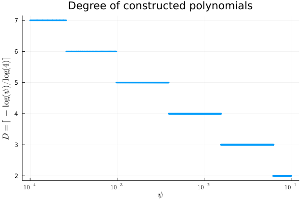

# Transforming data using $\texttt{OAVI}$
Finding the right transformation for your data with $\texttt{OAVI}$ is heavily tied to the vanishing parameter $\psi$. As previously stated, $\texttt{OAVI}$ terminates after having constructed polynomials of degree
```math
D = \lceil -\log(\psi)/\log(4) \rceil,
```
so tweaking the `psi` parameter is advised when searching for the best transformation. Below you can find a figure roughly indicating the influence of $\psi$ on the degree $D$. If you have some prior knowledge about the underlying structure of your data and can somewhat restrict the polynomial degree you need, limiting the range of $\psi$'s one tests can help avoid unnecessarily long runtime.



## Choosing the right transformation

Let's read in some data first. To keep it general we will create some small random .csv file but feel free to read in your favorite data set.

````@example docs_find_transform
using AVI
using DataFrames
using CSV
using Random

# create data
X = rand(100, 3)

# put it into a DataFrame
df = DataFrame(X, :auto)

# write it to 'example.csv' in 'examples' folder
CSV.write("examples/example.csv", df);

# read the data
read_df = CSV.read("examples/example.csv", DataFrame, types=Float64)

# convert DataFrame to Matrix
data = Matrix(read_df)
````

Be sure that you read in your data with `Float64` as the type for your data as `fit` assumes the entries in the data matrix to be of type `Float64`.

Now we can start finding which $\psi$ works best for us. Choose some values for $\psi$ you want to test, for example `psis = [0.01, 0.005, 0.001, 0.0005]`. Then you loop through each $\psi$, check the e.g. classification error using your favorite classifier and choose the one that performs best.

````@example docs_find_transform
# split train and test data
X_train, X_test = data[1:90, :], data[91:end, :]

# define psis
psis = [0.01, 0.005, 0.001, 0.0005]

# init best transform and best sets
best_transform, best_sets = nothing, nothing

# init error
error = Inf64

# loop psis
for psi in psis
    # transformation with current psi
    X_train_transformed, sets_train = fit(X_train; psi=psi)

    """
    We do not provide a built-in classifier so feel free to use your favorite one here.
    if X_train_transformed !== nothing
        new_error = classifier(X_train_transformed, class_labels)
        if new_error < error
            error = new_error
            best_transform, best_sets = X_train_transformed, sets_train
        end
    end
    """
end
````

## Applying the transformation
Having found the transformation that works best on your training set, you would naturally want to apply this transformation to the data you want to classify. Since we already computed the borders and related values when constructing the transformation, we want to avoid unnecessary and expensive recomputations on testing data. For this we provide the function `apply_G_transformation` which takes as arguments `sets` and `X_test` and transforms `X_test` according to the transformation stored in `sets`. As to not get an error, we will compute `best_transform` and `best_sets` as some basic transformation.

````@example docs_find_transform
# best transform and best sets
best_transform, best_sets = fit(X_train; psi=0.001)

# apply transformation to test set
X_test_transformed, sets_test = apply_G_transformation(best_sets, X_test)
````

Note that `X_test` has to have the same second dimension as `X_train`, that is `size(X_train, 2) == size(X_test, 2)`, so be careful when applying the transformation to other data.

Lastly, to be safe, we check that the dimensions of the transformations indeed match the number of vanishing polynomials constructed by the algorithm.

````@example docs_find_transform
println("Number of vanishing polynomials: ", size(best_sets.leading_terms, 2))
size(best_transform, 2) == size(X_test_transformed, 2) == size(best_sets.leading_terms, 2)
````

---

*This page was generated using [Literate.jl](https://github.com/fredrikekre/Literate.jl).*

